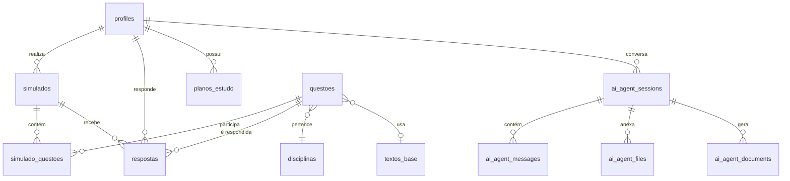

# 📊 RELATÓRIO FINAL - BANCÁRIO ÁGIL v1.0 (Open Source)

**Data de Geração:** 14 de Janeiro de 2026  
**Versão:** 1.0.0 - Open Source Edition  
**Status:** Produção

---

## 📋 SUMÁRIO EXECUTIVO

O **Bancário Ágil** é uma plataforma completa de preparação para concursos bancários, desenvolvida com tecnologias modernas e arquitetura escalável. Esta versão Open Source representa a base sólida para futuras expansões e monetização.

---

## 🏗️ ARQUITETURA DO SISTEMA

### Stack Tecnológico

| Camada | Tecnologia | Versão |
|--------|------------|--------|
| Frontend | React + TypeScript | 18.3.1 |
| Estilização | Tailwind CSS | 3.x |
| Roteamento | React Router DOM | 6.30.1 |
| UI Components | shadcn/ui + Radix UI | Latest |
| Estado | React Query + Context | 5.83.0 |
| Backend | Supabase (Lovable Cloud) | - |
| IA | Lovable AI Gateway + Gemini | - |
| Build Tool | Vite | Latest |

### Estrutura de Diretórios

```
src/
├── components/          # 85+ componentes React
│   ├── admin/          # 12 componentes administrativos
│   ├── dashboard/      # 8 componentes do painel
│   ├── especialista/   # 4 componentes do chat IA
│   ├── home/           # 5 componentes da landing page
│   ├── layout/         # 2 componentes de layout
│   ├── notifications/  # 2 componentes de notificações
│   ├── plano-estudo/   # 6 componentes do plano
│   ├── questoes/       # 8 componentes de questões
│   ├── simulado/       # 1 componente de timer
│   └── ui/             # 50+ componentes shadcn
├── hooks/              # 10 custom hooks
├── pages/              # 18 páginas
│   └── admin/          # 10 páginas administrativas
├── integrations/       # Configuração Supabase
└── lib/                # Utilitários
```

---

## 📱 FUNCIONALIDADES IMPLEMENTADAS

### 🎯 Módulo do Aluno

| Funcionalidade | Status | Descrição |
|----------------|--------|-----------|
| Dashboard Personalizado | ✅ | Estatísticas, progresso e recomendações |
| Simulados Completos | ✅ | Geração por IA com feedback instantâneo |
| Simulados Temáticos | ✅ | Filtro por disciplina |
| Banco de Questões | ✅ | Prática individual com histórico |
| Especialista IA | ✅ | Chat interativo para estudos |
| Plano de Estudos | ✅ | Wizard personalizado com IA |
| Análise de Bancas | ✅ | Upload de documentos + chat |
| Progresso Pareto | ✅ | Foco em disciplinas prioritárias |
| Gamificação | ✅ | Metas e conquistas |
| Notificações | ✅ | Alertas personalizados |
| Resultado Detalhado | ✅ | Gabarito e análise de erros |

### 🔐 Módulo Administrativo

| Funcionalidade | Status | Descrição |
|----------------|--------|-----------|
| Dashboard Admin | ✅ | Visão geral do sistema |
| Gestão de Usuários | ✅ | CRUD completo + convites |
| Gestão de Questões | ✅ | Upload individual e em lote |
| Central de Aprovação | ✅ | Workflow de revisão |
| Configuração do Especialista | ✅ | Prompt e documentos base |
| Estatísticas Gerais | ✅ | Métricas de uso |
| Logs de Sistema | ✅ | Auditoria de ações |
| Configurações Gerais | ✅ | Parâmetros do sistema |

### 🤖 Integrações IA

| Motor | Uso | Fallback |
|-------|-----|----------|
| Lovable AI Gateway | Principal | Sim |
| Google Gemini | Secundário | Sim |
| Sistema de Cache | Otimização | - |

---

## 🗄️ ESTRUTURA DO BANCO DE DADOS

### Tabelas Principais (22 tabelas)



### Tabelas por Categoria

**Usuários e Autenticação:**
- `profiles` - Dados dos usuários
- `user_roles` - Papéis (admin, user)
- `invites` - Tokens de convite

**Conteúdo Educacional:**
- `disciplinas` - Matérias do concurso
- `questoes` - Banco de questões
- `textos_base` - Textos de apoio

**Avaliações:**
- `simulados` - Provas simuladas
- `simulado_questoes` - Questões por simulado
- `respostas` - Respostas dos alunos
- `performance` - Métricas de desempenho
- `erros_analise` - Análise de erros

**Plano de Estudos:**
- `planos_estudo` - Configurações personalizadas

**IA e Chat:**
- `ai_agent_sessions` - Sessões de chat
- `ai_agent_messages` - Mensagens
- `ai_agent_files` - Arquivos enviados
- `ai_agent_documents` - Documentos gerados
- `ai_agent_simulations` - Simulados via chat

**Base de Conhecimento:**
- `agent_knowledge_documents` - Documentos do admin
- `agent_prompt_config` - Configuração do prompt
- `agent_data_sources` - Fontes de dados
- `analises_banca` - Análises de bancas

**Sistema:**
- `system_config` - Configurações gerais
- `admin_logs` - Logs administrativos
- `admin_notifications` - Notificações admin
- `notificacoes` - Notificações alunos
- `ai_engine_logs` - Logs de IA
- `ai_engine_metrics` - Métricas de IA
- `ai_response_cache` - Cache de respostas

---

## 🔒 SEGURANÇA

### Políticas RLS Implementadas

| Tabela | SELECT | INSERT | UPDATE | DELETE |
|--------|--------|--------|--------|--------|
| profiles | ✅ | ✅ | ✅ | ❌ |
| questoes | ✅ (público) | ✅ (admin) | ✅ (admin) | ✅ (admin) |
| simulados | ✅ (próprio) | ✅ | ✅ | ✅ |
| respostas | ✅ (próprio) | ✅ | ✅ | ✅ |
| ai_agent_sessions | ✅ (próprio) | ✅ | ✅ | ✅ |

### Autenticação

- Email/Senha com confirmação automática
- Sistema de convites para novos usuários
- Rotas protegidas por papel (user/admin)
- JWT tokens via Supabase Auth

---

## 📊 EDGE FUNCTIONS

| Função | Endpoint | Descrição |
|--------|----------|-----------|
| `ai-agent-chat` | POST | Chat com especialista IA |
| `generate-simulation` | POST | Gera simulados com IA |
| `record-answer` | POST | Registra respostas |
| `finish-simulation` | POST | Finaliza simulado |
| `create-user` | POST | Cria usuário via convite |
| `delete-user` | POST | Remove usuário |
| `extract-questions` | POST | Extrai questões de PDF |
| `parse-document` | POST | Processa documentos |
| `process-upload` | POST | Upload de arquivos |
| `unified-ai-engine` | POST | Motor IA unificado |
| `generate-gemini` | POST | Fallback Gemini |
| `process-knowledge-document` | POST | Base de conhecimento |
| `seed-knowledge-base` | POST | Seed inicial |

---

## 📈 MÉTRICAS DO PROJETO

### Código

| Métrica | Valor |
|---------|-------|
| Total de Arquivos | ~150 |
| Componentes React | 85+ |
| Custom Hooks | 10 |
| Edge Functions | 13 |
| Tabelas no Banco | 26 |
| Linhas de Código (estimado) | ~15.000 |

### Dependências

| Categoria | Quantidade |
|-----------|------------|
| Produção | 45 |
| UI (Radix) | 25 |
| Utilitários | 12 |
| Gráficos | 1 |
| PDF | 2 |

---

## ✅ PONTOS FORTES

1. **Arquitetura Moderna** - React 18 + TypeScript + Vite
2. **UI Consistente** - shadcn/ui com design system
3. **Backend Serverless** - Supabase com escalabilidade
4. **IA Integrada** - Múltiplos motores com fallback
5. **Segurança** - RLS completo + autenticação robusta
6. **Responsividade** - Mobile-first design
7. **Gamificação** - Metas e progresso visual
8. **Análise Inteligente** - Pareto + recomendações IA
9. **Flexibilidade** - Upload de documentos + chat
10. **Auditoria** - Logs completos de ações

---

## ⚠️ PONTOS DE ATENÇÃO

1. **Performance** - Otimização de queries grandes
2. **Cache** - Implementação mais agressiva
3. **Testes** - Cobertura automatizada
4. **Offline** - Suporte limitado
5. **Internacionalização** - Apenas português
6. **Acessibilidade** - Melhorias WCAG
7. **PWA** - Não implementado
8. **Analytics** - Métricas básicas
9. **Backup** - Automação necessária
10. **Documentação** - API não documentada

---

## 🚀 20 SUGESTÕES PARA VERSÃO PAGA (ASSINATURA)

### Tier Básico (R$ 29,90/mês)
1. **Simulados Ilimitados** - Sem limite de geração
2. **Histórico Completo** - Acesso a todo histórico de desempenho
3. **Exportação PDF** - Download de relatórios e análises
4. **Modo Offline** - Estudo sem internet (PWA)
5. **Sem Anúncios** - Experiência limpa

### Tier Pro (R$ 59,90/mês)
6. **Especialista IA Premium** - Respostas mais detalhadas e ilimitadas
7. **Plano de Estudos Avançado** - Com ajustes dinâmicos baseados em performance
8. **Análise Preditiva** - Probabilidade de aprovação
9. **Questões Exclusivas** - Banco premium com questões inéditas
10. **Simulados Cronometrados** - Condições reais de prova
11. **Revisão Espaçada** - Algoritmo de memorização
12. **Comunidade VIP** - Grupo exclusivo de alunos
13. **Webinars Mensais** - Aulas ao vivo com especialistas
14. **Correção de Redação** - IA analisa redações bancárias

### Tier Premium (R$ 99,90/mês)
15. **Mentoria Individual** - Chat 1:1 com professores
16. **Videoaulas Exclusivas** - Conteúdo em vídeo
17. **Simulados Personalizados** - Baseados nas suas fraquezas
18. **Garantia de Resultado** - Dinheiro de volta se não aprovar
19. **Acesso Antecipado** - Novas features antes de todos
20. **Multi-Concurso** - Preparação para vários concursos

---

## 💡 30 SUGESTÕES DE MELHORIAS PARA VERSÃO 2.0

### 🎨 Interface e UX

1. **Tema Escuro Completo** - Dark mode otimizado para estudos noturnos
2. **Personalização de Dashboard** - Widgets arrastáveis e configuráveis
3. **Atalhos de Teclado** - Navegação rápida com hotkeys
4. **Tour Guiado** - Onboarding interativo para novos usuários
5. **Animações Fluidas** - Micro-interações com Framer Motion
6. **Design Responsivo Aprimorado** - Tablets e dispositivos específicos

### 📚 Conteúdo e Aprendizado

7. **Flashcards Inteligentes** - Sistema de repetição espaçada (SRS)
8. **Mapas Mentais** - Visualização de conceitos interligados
9. **Podcasts Integrados** - Áudio das matérias para estudar em trânsito
10. **Resumos Automáticos** - IA gera resumos de cada disciplina
11. **Questões Comentadas em Vídeo** - Explicações gravadas
12. **Simulados Adaptativos** - Dificuldade ajusta automaticamente
13. **Banco de Redações** - Exemplos e modelos corrigidos
14. **Legislação Atualizada** - Integração com bases legais

### 🤖 Inteligência Artificial

15. **Tutor IA Personalizado** - Aprende seu estilo de aprendizado
16. **Geração de Questões** - IA cria questões inéditas
17. **Análise de Sentimento** - Detecta frustração e ajusta abordagem
18. **Previsão de Desempenho** - ML para prever nota final
19. **Chatbot com Voz** - Interação por áudio
20. **Resumos por IA** - Condensação automática de matérias

### 📊 Gamificação e Social

21. **Sistema de Ligas** - Competição semanal entre alunos
22. **Conquistas e Badges** - Mais de 50 achievements
23. **Ranking Nacional** - Compare-se com outros candidatos
24. **Grupos de Estudo** - Salas colaborativas
25. **Desafios Diários** - Missões com recompensas
26. **Perfil Público** - Compartilhe seu progresso

### 🔧 Técnico e Performance

27. **PWA Completo** - App instalável com offline
28. **Notificações Push** - Lembretes inteligentes
29. **Sincronização Multi-Device** - Estude em qualquer lugar
30. **API Pública** - Integrações com terceiros

---

## 📅 ROADMAP SUGERIDO

### Q1 2026 - Fundação v2.0
- [ ] Implementar PWA
- [ ] Sistema de flashcards
- [ ] Tema escuro
- [ ] Atalhos de teclado

### Q2 2026 - Monetização
- [ ] Sistema de assinaturas
- [ ] Tiers de planos
- [ ] Gateway de pagamento
- [ ] Área do assinante

### Q3 2026 - IA Avançada
- [ ] Tutor personalizado
- [ ] Geração de questões
- [ ] Análise preditiva
- [ ] Correção de redação

### Q4 2026 - Social
- [ ] Sistema de ligas
- [ ] Grupos de estudo
- [ ] Ranking nacional
- [ ] Comunidade VIP

---

## 📝 CONCLUSÃO

A versão 1.0 Open Source do **Bancário Ágil** representa uma base sólida e funcional para preparação de concursos bancários. Com uma arquitetura moderna, integrações de IA e funcionalidades completas, o sistema está pronto para evolução.

As sugestões apresentadas para a versão paga e 2.0 visam:
- **Monetização sustentável** através de tiers de assinatura
- **Diferenciação competitiva** com features premium
- **Engajamento** através de gamificação e social
- **Escalabilidade** com melhorias técnicas

O caminho para uma plataforma EdTech de sucesso está traçado. 🚀

---

**Gerado automaticamente pelo sistema Bancário Ágil**  
**© 2026 - Todos os direitos reservados**
